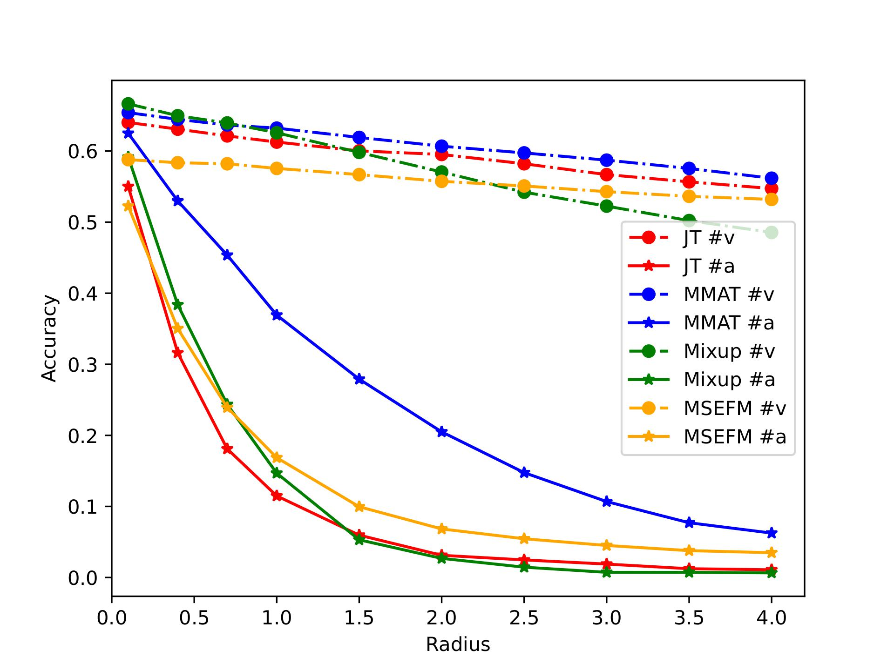
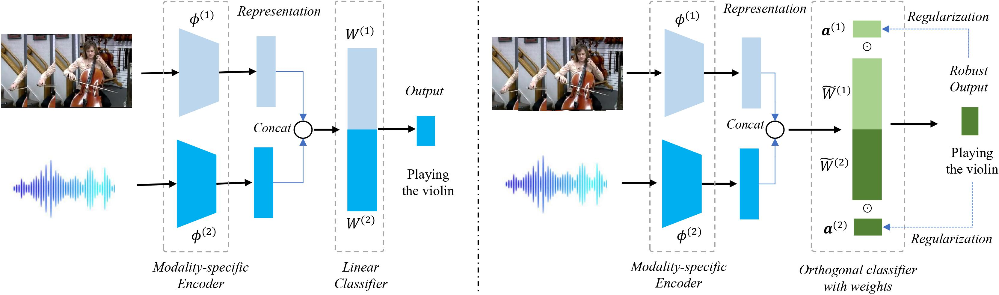

# Official Certifiable Robust Multi-modal Training in PyTorch


Here is the official PyTorch implementation of *Certifiable Robust Multi-modal Training* (CRMT) proposed in ''*Quantifying and Enhancing Multi-modal Robustness with Modality Preference*'', which is a flexible training procedure to improve the robustness of multimodal learning. Please refer to our [ICLR 2024 paper]() for more details.

**Paper Title: "Quantifying and Enhancing Multi-modal Robustness with Modality Preference"**

**Authors: [Zequn Yang](https://bjlfzs.github.io/), [Yake Wei](https://echo0409.github.io/), Ce Liang and [Di Hu](https://dtaoo.github.io/index.html)**

**Accepted by: The Twelfth International Conference on Learning Representations (ICLR 2024)**

<!-- **[[arXiv](https://arxiv.org/abs/)]** **[[Supplementary Material](https://github.com/GeWu-Lab/)]**  -->


## Multi-modal model is vulnerable toward a certain modality.

We observe that when encountering attack on different modality, multi-modal model can be vulnerable to certain modality. The following figure presents the how different multi-modal model performs in each uni-modal attack. As shown in the following figure, attack on the audio modality (#a, dot dash line) lead to more performance discrepancy than visual modality (#v, full line). That indicates that the preferred modality, audio, is not always the robust one, and thus should be paid attention on in multi-modal learning. 

<!-- **the potential of multimodal information is not fully exploited even when the multimodal model outperforms its uni-modal counterpart.** We conduct linear probing experiments to explore the quality of jointly trained encoders, and find them under-optimized (the yellow line) compared with the uni-modal model (the red line). We proposed the OGM-GE method to improve the optimization process adaptively and achieved consistent improvement (the blue line). We improve both the multimodal performance and uni-model representation as shown in the following figure. -->
<div  align="center">    

<figcaption style="font-family: Arial, sans-serif; font-size: 14px; color: #333;"> Accuracy of different multi-modal robust training methods compared with Joint Training (JT) baseline under $\ell_2$-PGD attack with a range of radius for modality #v (vision) and #a (audio) respectively on Kinetics Sounds dataset. Results show that all these methods are more vulnerable to attacks on the specific modality #$a$. </figcaption>
</div>


## Analysis

Here, we provide theoretical support to explain this phenomenon. First, we derive the certified bound for multi-modal model. Subsequently, we figure out that both **uni-modal representation margin** and **integration of modalities** are two essential components of the certified robustness of multi-modal model. And these two components is easily limited by modality preference. Further, we also analyze the certified robustness of each modality, which indicate that **multi-modal model can prefer vulnerable modality**, thus making attacks on this preferred modality more effective, explaining the observation above. The detailed analysis can be found in our paper.

## Method Introduction

Supported by these analysis before, we seek for stably enhancing the certified robustness. However, directly regulations of these two compoenets are intricately linked with the last linear classifier $W$ of the multi-modal model, potentially leading to conflicts in optimization objectives. Hence, we modify the last linear classifier, add orthogonality and additional weight on it. (See the following figure).
<div  align="center">    

<figcaption style="font-family: Arial, sans-serif; font-size: 14px; color: #333;"> Comparison between original Joint Training framework and our proposed CRMT-JT framework. </figcaption>
</div>

With this newly proposed framework, the pipeline of our certified robust multi-modal training algorithm consists of two sub-process:

1. Optimize with cross-entropy loss and margin regularization with term $\rho$:  
   $$\min_{{a}^{(m)}, \tilde{W}^{(m)}, \phi^{(m)}} \frac{1}{N} \sum_{i=1}^N \left(CE(h({x}_i), y_i) + \rho   \log \sum_{m=1}^2 \frac{\sum_{k \neq y} \exp( \tilde{W}^{(m)}_{k\cdot} \phi^{(m)} ({x}_i^{(m)}))}{ \exp(\tilde{W}^{(m)}_{y\cdot} \phi^{(m)} ({x}_i^{(m)}))}\right), $$

3. Fix $\tilde{W}^{(m)}, \phi^{(m)}$, update ${a}^{(m)}$ to approach higher certified robustness: 
$\min_{{a}^{(m)}}~~ L_2 = -\frac{1}{N} \sum_{i=1}^N r({x}_i),$ where $r({x})$ is the certified lower bound.


## Get Started
### Requirements 
<pre><code>
pip install -r requirements.txt
</code></pre>

### Run
You can simply run the demo on MSRC-v1 dataset using:  
<pre><code>
python main.py --methods=CRMT-JT --methods.gamma=1.0
</code></pre>
You can adjust the algorithm's detailed setting by modifying parameters such as $\rho$. Alternate datasets can also be utilized, provided they adhere to the following preparation protocol.

### Data Preparation

The original datasets we used can be found in：
[Kinetics-Sounds](https://github.com/cvdfoundation/kinetics-dataset).
[UCF-101](https://www.crcv.ucf.edu/data/UCF101.php),
[VGGSound](https://www.robots.ox.ac.uk/~vgg/data/vggsound/),


## Certifiable Robust Multi-modal Training

Our proposed Certifiable Robust Multi-modal Training (CRMT) can be applied on three training strategy, denoted as *Certifiable Robust Multi-modal Training with Joint Training* (CRMT-JT), *CRMT with Adversarial Training* (CRMT-AT), and *CRMT with Mixup* (CRMT-Mix).

## Core code demo

As a flexible training procedure, our proposed CRMT can be easily integrated into existing multimodal learning frameworks. Since the detailed implementation of multimodal learning models varies, we provide a simple demo to illustrate how to integrate CRMT into a multimodal joint learning, that is CRMT_JT. We dispaly the training of the step one as following:
```python
    ---in training step 1 ---

    # out_v, out_a are the output of each uni-modality model, sharing the same shape (batch_size * label_num) with out. 
    out_v, out_a, out = model(visual, audio)
    outs = [out_v, out_a]
    rows = torch.arange(batch_size)
    exp_margin_loss = 0.0
    for modality in range(num_modal):
        out_cur = outs[modality]
        exp_margin_loss = exp_margin_loss + (torch.sum(torch.exp(out_cur), dim = 1) * torch.exp(-out_cur[rows, labels]) - 1)
    loss_margin = torch.mean(torch.log(exp_margin_loss + 1e-5)) * rho
    loss = criterion(out, labels) + loss_margin
    loss.backward()
    optimizer.step()

    ---continue for next training step---
```
Note that for CRMT_AT and CRMT_Mix, the training step 1 is not the same as the above. The main difference of CRMT_AT and CRMT_Mix lies in the input data, which is the adversarial samples and mixup samples, respectively.
Furthermore, since the mixup could mix samples with two different labels, the loss_margin should be modified to enlarge the margin between these two labels and other labels. Hence we use a indicator vector to distinguish whether the two labels are the same or not shown in the following code:

```python
  data, targets_a, targets_b, lam = mixup_data([visual, audio], labels, alpha=1.0)
  outs = [out_v, out_a]
  rows = torch.arange(batch_size)
  same_target = (targets_a != targets_b)
  for modality in range(num_modal):
      numerator = torch.sum(torch.exp(outs[modality]), dim = 1) \
                - outs[modality][rows, targets_a] - outs[modality][rows, targets_b] * same_target       
```

The detailed implementation can be found in our code.
Moreover, the training step 2 is the same for all the three training strategies.The second step of our training procedure is to optimize the integration weight to approach higher certified robustness. The detailed implementation can be found in our code. It contains two sub-step:

1. Get the idx of the largest output (except for the labels), which is realized by a mask operation.
2. Calculate the certified lower bound and update the integration weight to approach higher certified robustness.
  
## Citation

If you find this work useful, please consider citing it.
<pre><code>
@inproceedings{yang2024Quantifying,
  title={Quantifying and Enhancing Multi-modal Robustness with Modality Preference},
  author={Zequn Yang and Wei, Yake and Ce Liang and Hu, Di},
  booktitle={The Twelfth International Conference on Learning Representations},
  year={2024}
}
</code></pre>

## Acknowledgement

This research was supported by National Natural Science Foundation of China (NO.62106272), the Young Elite Scientists Sponsorship Program by CAST (2021QNRC001), and Public Computing Cloud, Renmin University of China.


<!-- ## License

This project is released under the [GNU General Public License v3.0](https://github.com/Mukosame/Zooming-Slow-Mo-CVPR-2020/blob/master/LICENSE). -->


## Contact us

If you have any detailed questions or suggestions, you can email us:
**zqyang@ruc.edu.cn** 